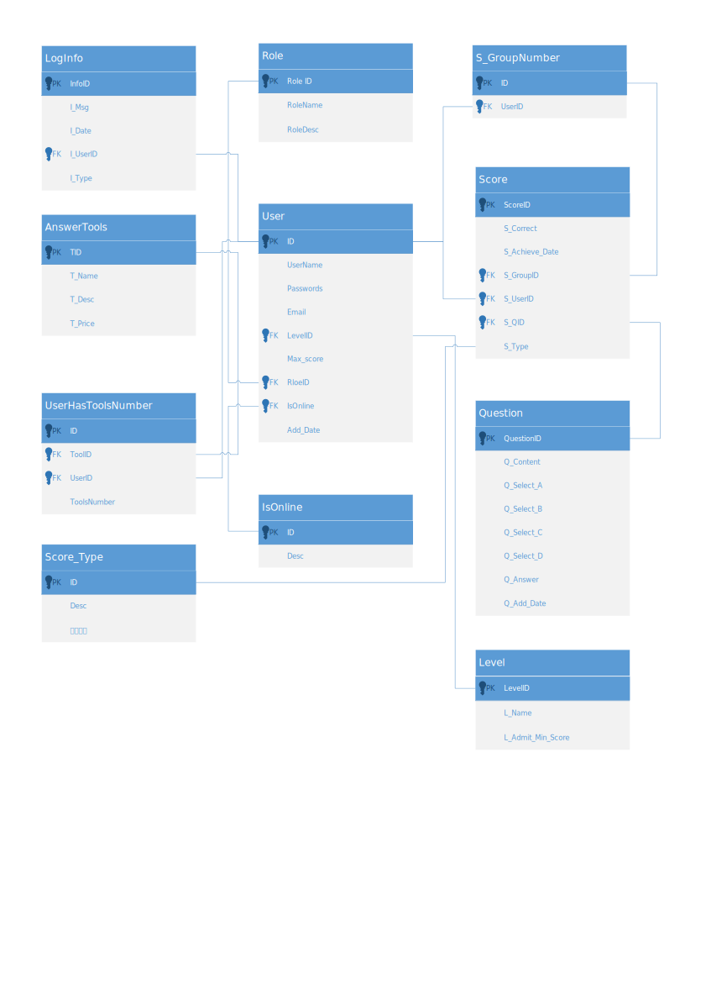

# 重写答题游戏网站
## 1. 原因
第一版写的比较混乱，每个页面的css也会相互影响，还缺少一些功能。

## 2. 介绍
我们做希望做的答题游戏的网站，包含以下模块
- 用户中心
- 登陆界面
- 首页
- 个人答题
- PK答题
- 分数排行榜
- 道具
- 日志
- 用户管理
- 题库管理
- 道具管理


## 3. 数据库ER图设计如下图



## 4. 更新日志

[日志连接](./日志.md)

## 5. 关于数据库
- 适用的数据库版本为SQLSERVER 2012
- sa登录密码项目内默认使用123456

## 6. 提示
- 使用的是CodeFirst的开发模式
- 克隆本地方法
```
git clone https://gitee.com/harry7988/rewriting_the_answer_game_web_site.git
```

